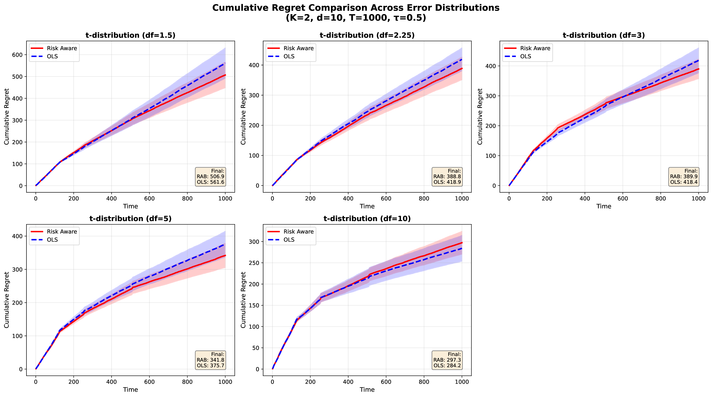
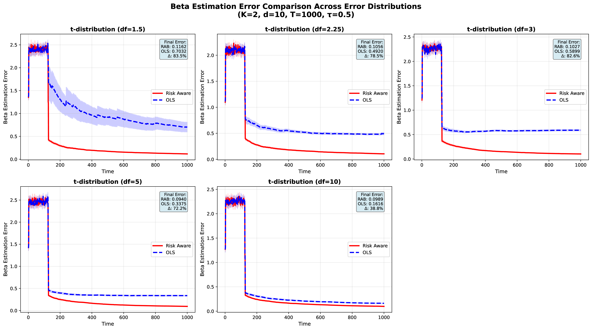

# 607-project-02
This is the second project for 25FA STATS607. 

## **Project Description**
This repository includes code on the comparison between a Risk-aware Contextual Bandit (using quantile regression as update) and an OLS bandit. The comparison mostly focuses on the scenarios with heavy-tailed errors.

## **Setup Instructions**

1. **Clone the repository:**
```bash
git clone <repository-url>
cd bandit-simulation
```

2. **Install dependencies:**
```bash
make install
# OR manually:
pip install -r requirements.txt
```

3. **Verify installation:**
```bash
make test
```

## **Run Complete Analysis**
```bash
make all
```
This command:
1. Creates necessary directories
2. Runs simulations across 5 error distributions (df = 1.5, 2.25, 3, 5, 10)
3. Generates summary statistics (CSV)
4. Creates all visualizations (PDFs)
5. Saves results to `results/` directory


After running `make all`, you'll find:

```
results/
├── data/                              # Raw simulation results
│   ├── simulation_*.pkl              # Pickled results
│   └── simulation_*_metadata.json    # Simulation metadata
├── figures/                          # Visualizations
│   ├── regret_comparison.pdf        # Cumulative regret plots
│   └── beta_error_comparison.pdf    # Estimation error plots
└── summary_statistics.csv           # Performance metrics table
```

## **Estimated Runtime**
About 8 minutes with make all command. 

## **Summary of Key Findings**


When the number of arms $K=2$, the cumulative regret for risk-aware bandit is slightly better than the OLS bandit, especially when the error distribution is heavy-tailed. But as the degree of freedom increases, the advantage becomes less. 


RAB (Risk-aware Bandit) has an obvious advantage for the recovery of the true beta value, especially when the error has heavy-tailed distributions. 

